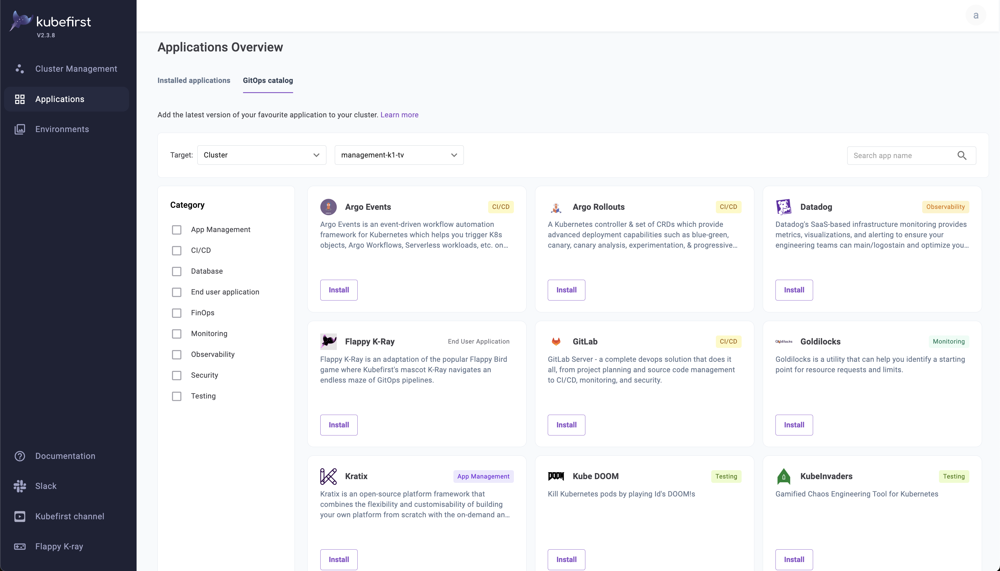

<!-- markdownlint-disable MD041 -->

  <picture>
    <source media="(prefers-color-scheme: dark)" srcset="img/kubefirst-light.svg" alt="Kubefirst Logo">
    
  </picture>

# Community-driven Cloud Native GitOps

The kubefirst [GitOps Catalog](https://docs.kubefirst.io/aws/gitops-catalog) repository is a community-driven series of cloud native apps that can be added onto the kubefirst platform easily once the platform has been provisioned.

## Contributing

To contribute to the GitOps Catalog, check the [CONTRIBUTING.md](CONTRIBUTING.md) file.
